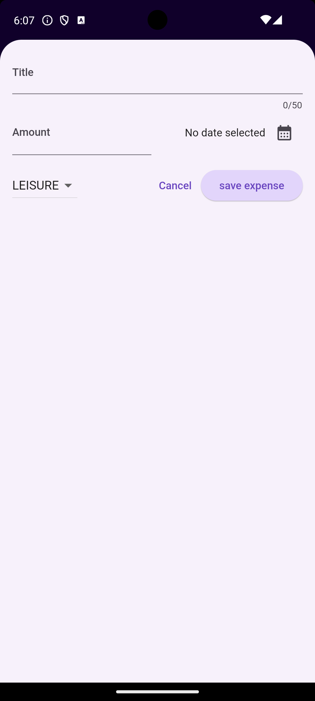
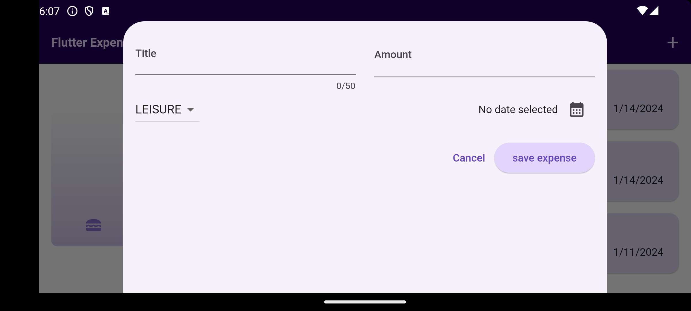
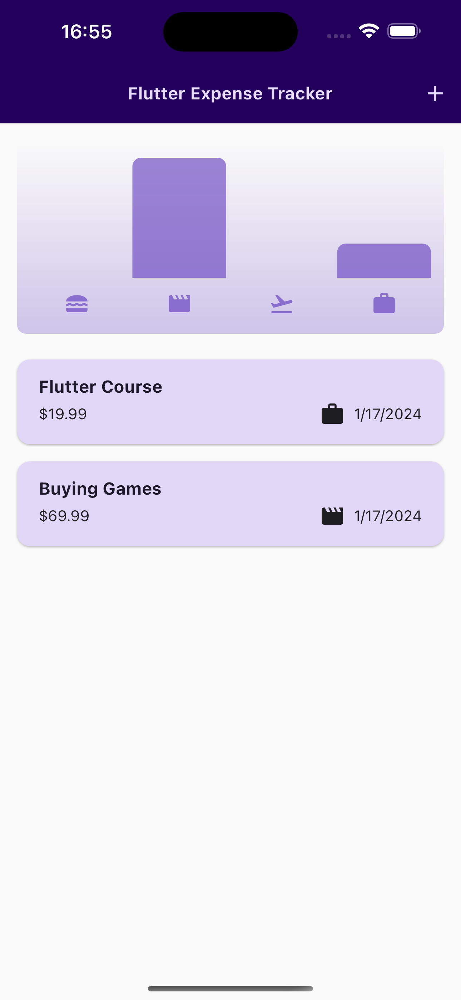

# Expense Tracker (Adaptiv)

Expense Tracker is a Flutter app that helps you keep track of all your expenses and better understand your spending habbits! This code was produced during the completion of the Flutter course [A Complete Guide to the Flutter SDK & Flutter Framework for building native iOS and Android apps](https://www.udemy.com/course/learn-flutter-dart-to-build-ios-android-apps/learn/lecture/37130436#overview).

## Basic functionality
- Showing all expenses in a list
- Being able to categorize expenses
- Displaying the different types of expenses in a chart
- Adding new expenses with the title, amount, type and date

### Screenshots light mode android

  

  

### Screenshots iOS with cupertino

  

  

### Example walkthrough android

  

## Topics covered (Branch Basic)

- Used [uuid](https://pub.dev/packages/uuid) to create unique id's.
- Used enums for dummy data
- Used [intl](https://pub.dev/packages/intl) to format dates
- Used Appbar within the scaffold Widget
- Used Icons
- Used themedata for Material3
- Used Modal bottom sheets
- Caught and saved user input
- Learned about controller
- Used Lifecycle Methods
- Used DatePicker
- Learned about and used Futures
- Used async functions
- Implemented drop down menu
- Input validation with tryParse and Error outputs with AlertDialog
- Used Dismissible Widgets and got an introduction to keys
- Used ScaffoldMessenger and Snackbar to display messages when deleting items and - being able to restore them
- Used copyWith on ThemeData to keep some basic styles given by flutter while overriding the values i needed to change
- Learned about sub widget themes like the ElevatedButtonThemeData
- Used global theme variables for styling the app
- Used similar to copyWith the styleFrom method
- Learned about inconsistency within flutter such as copyWith and styleFrom
- Styled buttons, colors and texts
- Used Theme.of to access themedata
- Implemented darkmode and learned about setting the thememode
- Used the for in loop
- Learned about alternatice constructor functions
- Learned about FractionalySizedBox
- Used for in on widgets
- Used code from a [github repo](https://github.com/academind/flutter-complete-guide-course-resources/tree/main/Lecture%20Attachments/05%20Interactivity%20%26%20Theming/chart) to adjust it for my own project

## Topics covered (Branch Adaptiv)
- Learned about Displaying a screen dependend on the available width (diaplaying based on orientation).
- Learned about Widget size preferences and parent size constraints.
- From MediaQuery used viewInsets.bottom to safe the height and adjust the overlapping space of the soft keyboard.
- Used safearea to not overlap device features with the modal sheet.
- Displayed elements depending on the max with the LayoutBuilder.
- Learned about making the app adaptive with the cupertino dialogue.
- Use of Cupertino for iOS specific designs.

# Note 
The code within the new_expense.dart file could be improved. For example the widgets that are reused should be put into seperate files for better readability. However I kept it here the way it is to better demonstrate the act of conditional rendering via copy pasting.
